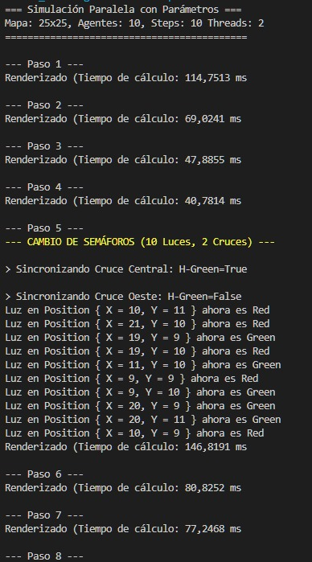
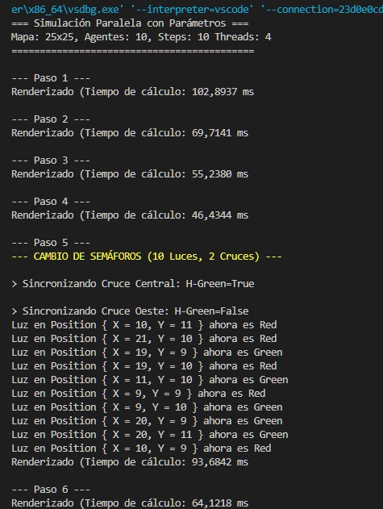

# Tiempos de Ejecución - Simulación Paralela

## Simulación con 2 Hilos

| Paso | Acción | Tiempo (ms) |
|------|--------|-------------|
| 1 | Renderizado | 114.7513 |
| 2 | Renderizado | 69.0241 |
| 3 | Renderizado | 47.8855 |
| 4 | Renderizado | 40.7814 |
| 5 | Cambio de semáforos + Renderizado | 146.8191 |
| 6 | Renderizado | 80.8252 |
| 7 | Renderizado | 77.2468 |
| 8 | Renderizado | 75.0705 |
| 9 | Renderizado | 56.7112 |
| 10 | Cambio de semáforos + Renderizado | 57.0367 |

**Tiempo total:** 5930.2311 ms

---

## Simulación con 4 Hilos

| Paso | Acción | Tiempo (ms) |
|------|--------|-------------|
| 1 | Renderizado | 102.8937 |
| 2 | Renderizado | 69.7141 |
| 3 | Renderizado | 55.2380 |
| 4 | Renderizado | 46.4344 |
| 5 | Cambio de semáforos + Renderizado | 93.6842 |
| 6 | Renderizado | 64.1218 |
| 7 | Renderizado | 56.3608 |
| 8 | Renderizado | 62.0128 |
| 9 | Renderizado | 60.8938 |
| 10 | Cambio de semáforos + Renderizado | 61.4491 |

**Tiempo total:** 5907.1150 ms

---

## Comparación

| Configuración | Tiempo Total | Diferencia | Reducción |
|---------------|--------------|------------|-----------|
| 2 Hilos | 5930.23 ms | - | - |
| 4 Hilos | 5907.12 ms | -23.11 ms | 0.39% |

**Observación:** La mejora al aumentar de 2 a 4 hilos es mínima (0.39%), lo que indica que la carga es más ligera para justificar el paralelismo adicional.

## Screenshots
**2 Núcleos:**

**4 Núcleos:**

