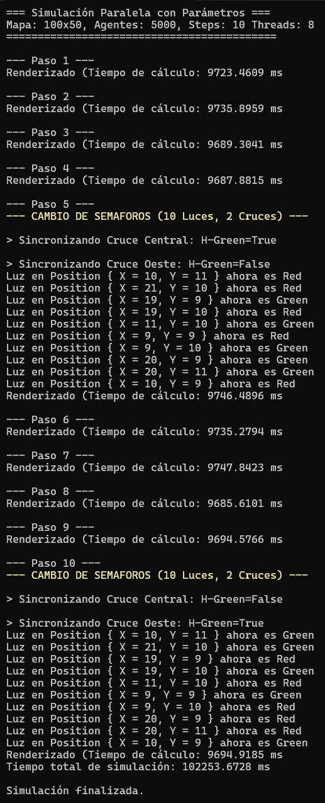

# Comparación de Simulación Paralela: 8 vs 16 Hilos

## Parámetros Generales
- Mapa: 100x50  
- Agentes: 5000  
- Steps: 10  

---

## Simulación con 8 Hilos
| Paso | Acción | Tiempo de ejecución (ms) |
|------|--------|--------------------------|
| 1    | Renderizado | 9726.77 |
| 2    | Renderizado | 9692.28 |
| 3    | Renderizado | 9732.16 |
| 4    | Renderizado | 9751.51 |
| 5    | Cambio de semáforos + Renderizado | 9741.49 |
| 6    | Renderizado | 9769.84 |
| 7    | Renderizado | 9747.66 |
| 8    | Renderizado | 9754.00 |
| 9    | Renderizado | 9766.57 |
| 10   | Cambio de semáforos + Renderizado | 9764.13 |
| **Total** |  | **102580.64** |

---

## Simulación con 16 Hilos
| Paso | Acción | Tiempo de ejecución (ms) |
|------|--------|--------------------------|
| 1    | Renderizado | 4877.64 |
| 2    | Renderizado | 4991.76 |
| 3    | Renderizado | 5007.95 |
| 4    | Renderizado | 4992.97 |
| 5    | Cambio de semáforos + Renderizado | 5000.48 |
| 6    | Renderizado | 5038.37 |
| 7    | Renderizado | 5027.62 |
| 8    | Renderizado | 4977.00 |
| 9    | Renderizado | 5008.80 |
| 10   | Cambio de semáforos + Renderizado | 5017.52 |
| **Total** |  | **55022.23** |

---

## Comparación y Observaciones
- **Tiempo total con 8 hilos:** 102580.64 ms  
- **Tiempo total con 16 hilos:** 55022.23 ms  
- **Reducción de tiempo:** ~46% al duplicar los hilos.  

- Cada paso se ejecuta aproximadamente a la mitad del tiempo al aumentar los hilos de 8 a 16, mostrando un buen aprovechamiento del paralelismo.  
- Los pasos de cambio de semáforos incluyen operaciones de sincronización, pero el impacto en tiempo es similar al de un renderizado normal.  

---

## Screenshots
**8 Núcleos:**

**16 Núcleos:**

