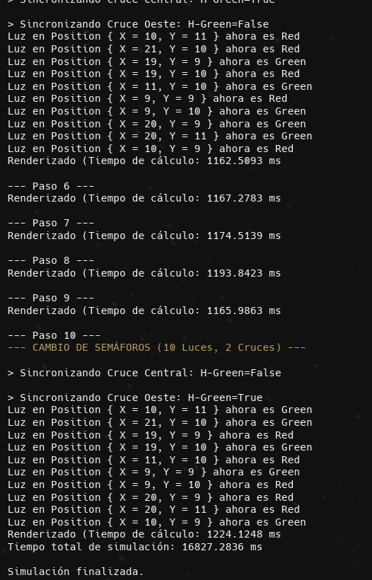

# Test Secuencial (unico hilo)

Este test se ejecuta en modo secuencial para simular el trafico en una ciudad de tamaño 50x20 con 1000 agentes durante 10 pasos de simulación. El objetivo es evaluar el rendimiento y la eficiencia del programa utilizando solamente un hilo que se encargue de todo, y comparar sus resultados con los obtenidos en el test paralelo.

## Configuracion

```cs
var config = new SimulationConfig(
                mapWidth: 50,
                mapHeight: 20,
                agentCount: 1000,
                simulationSteps: 10,
            );
```

## Resultados

Resumen por Paso

### **Paso 1**

- **Acción:** Renderizado
- **Tiempo:** 1158.0653 ms

### **Paso 2**

- **Acción:** Renderizado
- **Tiempo:** 1183.3194 ms

### **Paso 3**

- **Acción:** Renderizado
- **Tiempo:** 1197.6828 ms

### **Paso 4**

- **Acción:** Renderizado
- **Tiempo:** 1176.0331 ms

### **Paso 5**

- **Acción:** Renderizado + Cambio de semáforos (10 luces, 2 cruces)
  - Cruce Central → `H-Green = True`
  - Cruce Oeste → `H-Green = False`
- **Tiempo:** 1162.5093 ms

### **Paso 6**

- **Acción:** Renderizado
- **Tiempo:** 1167.2783 ms

### **Paso 7**

- **Acción:** Renderizado
- **Tiempo:** 1174.5139 ms

### **Paso 8**

- **Acción:** Renderizado
- **Tiempo:** 1193.8423 ms

### **Paso 9**

- **Acción:** Renderizado
- **Tiempo:** 1165.9863 ms

### **Paso 10**

- **Acción:** Renderizado + Cambio de semáforos (10 luces, 2 cruces)
  - Cruce Central → `H-Green = False`
  - Cruce Oeste → `H-Green = True`
- **Tiempo:** 1224.1248 ms

---

## 🟩 Tiempo total final

### **16,827.2836 ms**

## Screenshot:


